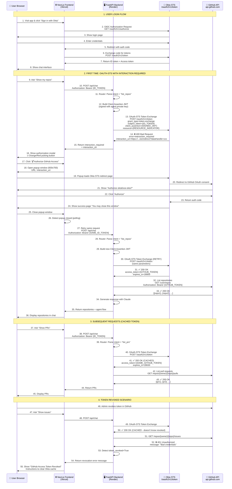
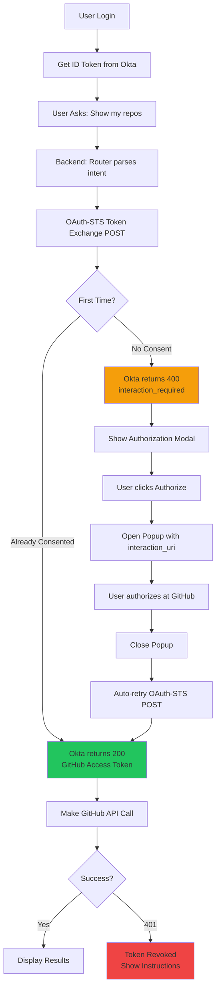

# OAuth-STS Sequence Diagram - DevOps Agent

Complete sequence diagram showing the Okta Brokered Consent (OAuth-STS) flow for AI agents.

---

## Complete Flow Diagram



---

## Key Flows Breakdown

### Flow 1: User Authentication (Steps 1-8)
- User logs into Okta via OIDC
- Gets ID token from "linked application"
- This ID token is used for OAuth-STS

### Flow 2: First Time OAuth-STS (Steps 9-36)
- Backend makes OAuth-STS POST request
- Okta returns `interaction_required` with `interaction_uri`
- User authorizes via popup
- Retry OAuth-STS → Gets GitHub token
- Makes GitHub API call

### Flow 3: Subsequent Requests (Steps 37-45)
- OAuth-STS returns cached GitHub token (fast!)
- No authorization needed
- Direct GitHub API calls

### Flow 4: Token Revoked (Steps 46-55)
- GitHub returns 401 (token revoked)
- Okta still has cached token
- Shows error with instructions to clear cache

---

## Alternative: Mermaid Diagram (For GitHub/Docs)

If you want to render this in GitHub or documentation tools, save as `.mmd` file:



---

## Component Interaction Summary

| Component | Role | Key Actions |
|-----------|------|-------------|
| **Next.js Frontend** | User interface | Shows modal, opens popup, handles retry |
| **FastAPI Backend** | Orchestrator | Routes requests, manages OAuth-STS flow |
| **Okta STS** | Token broker | Exchanges ID token for GitHub token |
| **GitHub API** | Resource provider | Returns repos/PRs/issues data |

---

## OAuth-STS Request/Response

### Request Format
```http
POST /oauth2/v1/token HTTP/1.1
Host: rkumariagoie.oktapreview.com
Content-Type: application/x-www-form-urlencoded

grant_type=urn:ietf:params:oauth:grant-type:token-exchange
requested_token_type=urn:okta:params:oauth:token-type:oauth-sts
subject_token=eyJhbGci...  (User's ID token)
subject_token_type=urn:ietf:params:oauth:token-type:id_token
client_assertion_type=urn:ietf:params:oauth:client-assertion-type:jwt-bearer
client_assertion=eyJhbGci...  (Signed JWT with agent's private key)
resource=rajeshkumar-okta:github:application
```

### Response: Success (200)
```json
{
  "access_token": "gho_xxxxxxxxxxxx",
  "token_type": "Bearer",
  "expires_in": 28800
}
```

### Response: Interaction Required (400)
```json
{
  "error": "interaction_required",
  "error_description": "User authorization is required",
  "interaction_uri": "https://rkumariagoie.oktapreview.com/oauth2/v1/sts/redirect?dataHandle=xxx"
}
```

---

## Timing Information

| Operation | Typical Duration |
|-----------|------------------|
| User Login (OIDC) | 2-5 seconds |
| OAuth-STS Token Exchange | 500-1000ms |
| GitHub API Call | 200-500ms |
| Authorization Popup (first time) | 10-30 seconds (user dependent) |
| Total First Request | ~15-35 seconds |
| Total Subsequent Requests | ~2-3 seconds |

---

## State Machine

```
┌──────────────┐
│  Unauthenticated  │
└────────┬─────────┘
         │ Login
         ▼
┌──────────────┐
│ Authenticated │
│ (Has ID Token)│
└────────┬─────────┘
         │ Request GitHub operation
         ▼
┌──────────────────┐
│ OAuth-STS Exchange│
└────────┬─────────┘
         │
    ┌────┴─────┐
    │          │
    ▼          ▼
┌────────┐  ┌──────────────┐
│ Success│  │interaction_  │
│200 OK  │  │required 400  │
└───┬────┘  └──────┬───────┘
    │              │
    │              ▼
    │       ┌─────────────┐
    │       │Show Modal   │
    │       │User         │
    │       │Authorizes   │
    │       └──────┬──────┘
    │              │ Retry
    │              ▼
    └──────────────┤
                   ▼
            ┌─────────────┐
            │GitHub API   │
            │Call         │
            └──────┬──────┘
                   │
              ┌────┴────┐
              │         │
              ▼         ▼
         ┌─────┐   ┌──────┐
         │200  │   │ 401  │
         │OK   │   │Token │
         └──┬──┘   │Revoked
            │      └───┬──┘
            ▼          ▼
      ┌────────┐  ┌─────────┐
      │Display │  │Show     │
      │Results │  │Error    │
      └────────┘  └─────────┘
```

---

**Diagram saved in:** `docs/SEQUENCE_DIAGRAM.md`

You can view it on GitHub (renders Mermaid automatically) or use tools like:
- https://mermaid.live/
- VS Code with Mermaid extension
- GitHub markdown preview

🎉 **Congratulations! Your DevOps Agent with OAuth-STS is now fully working and deployed!** 🚀
